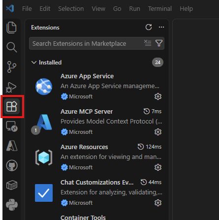
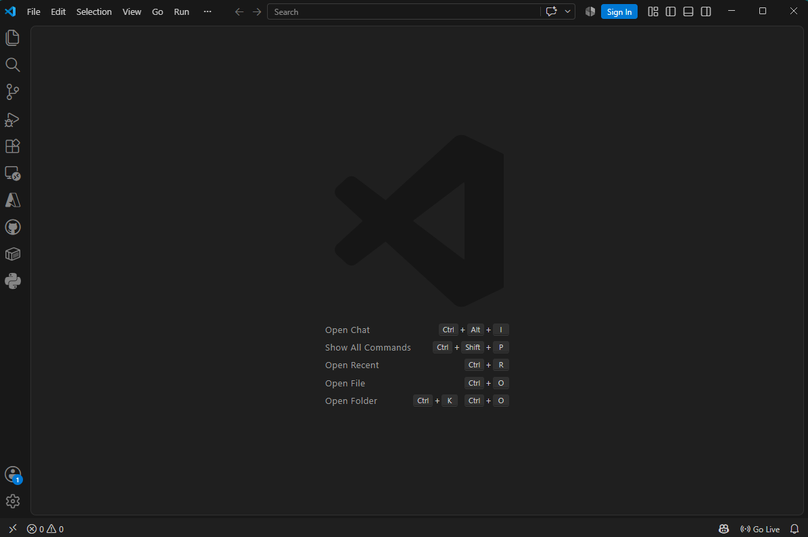
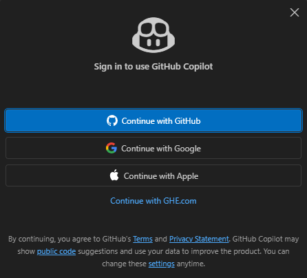
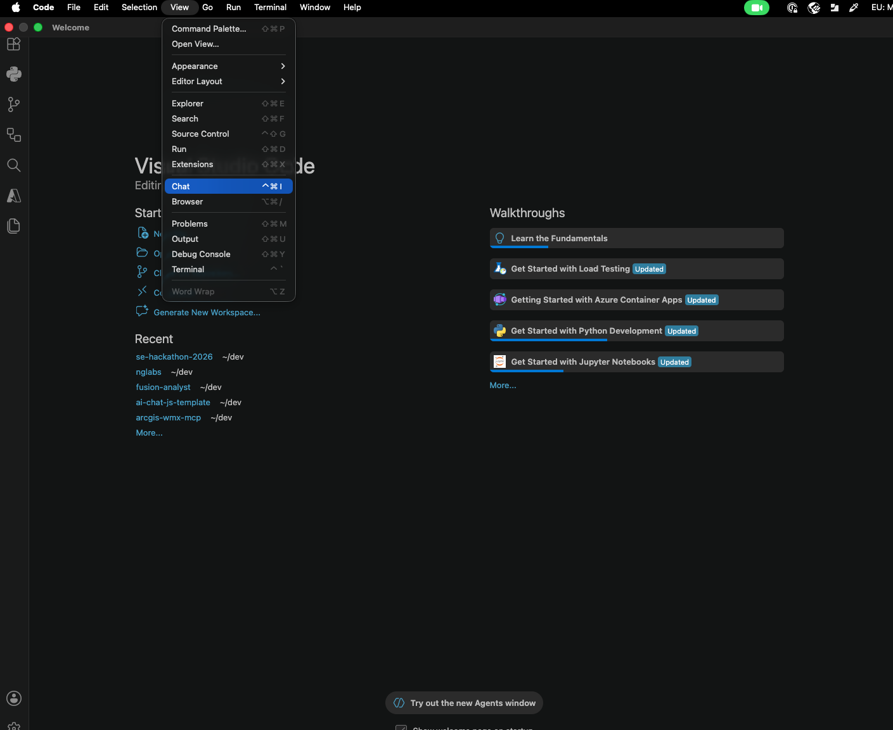
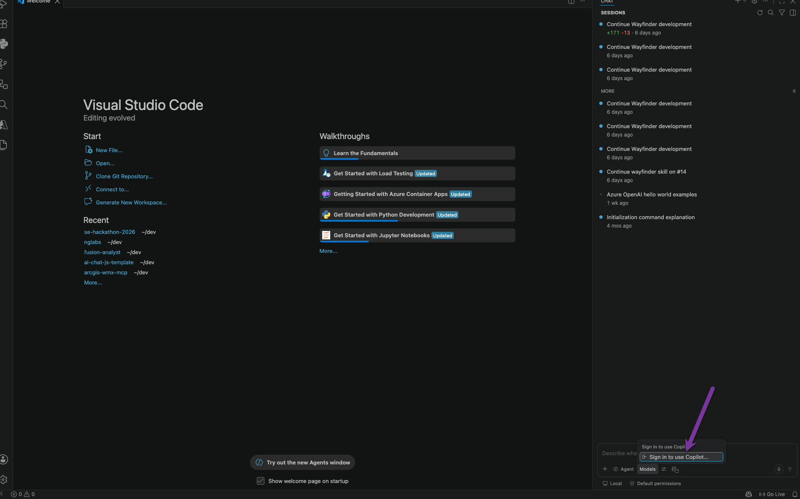
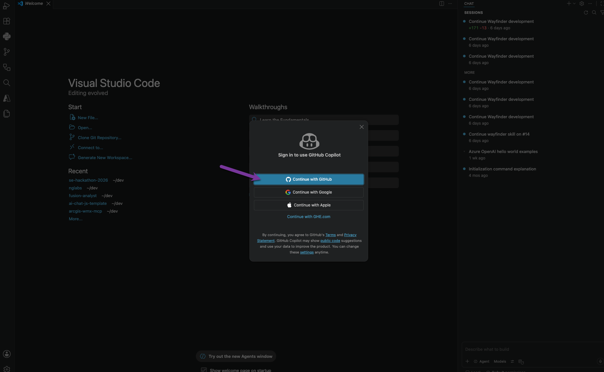
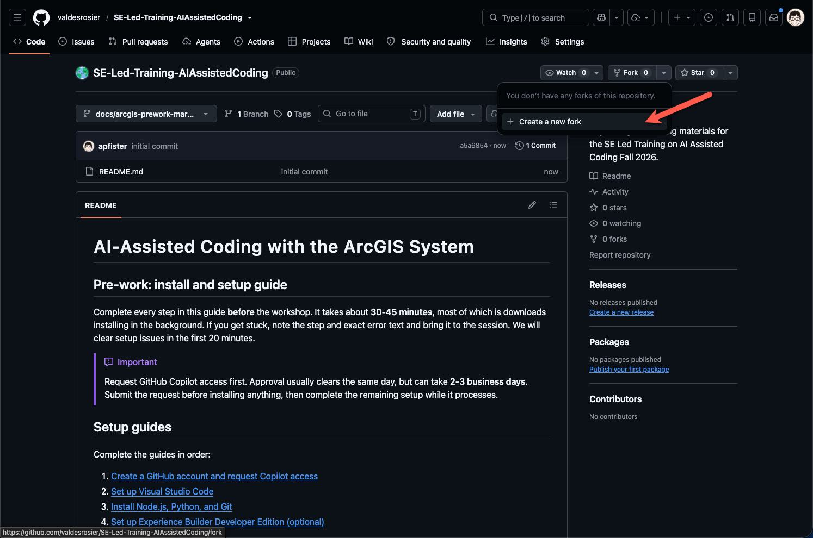
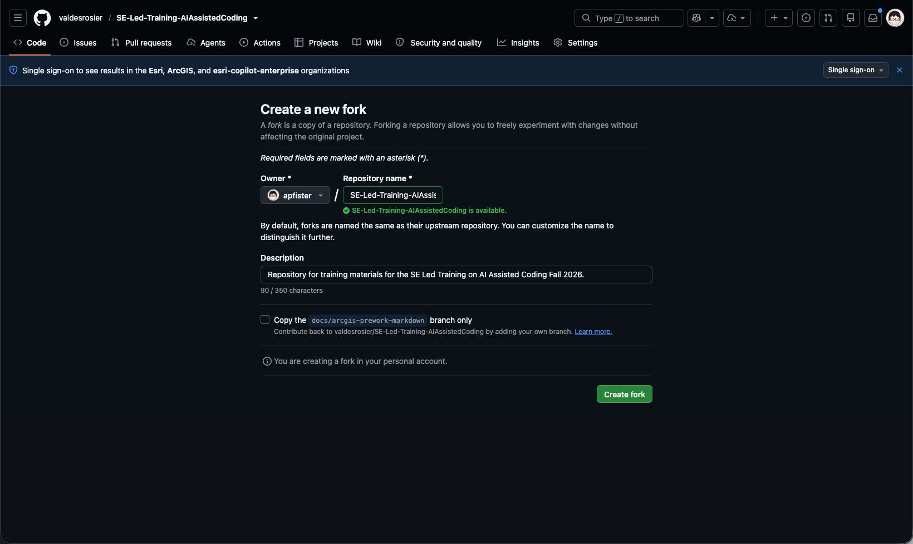
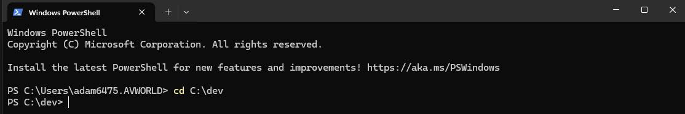
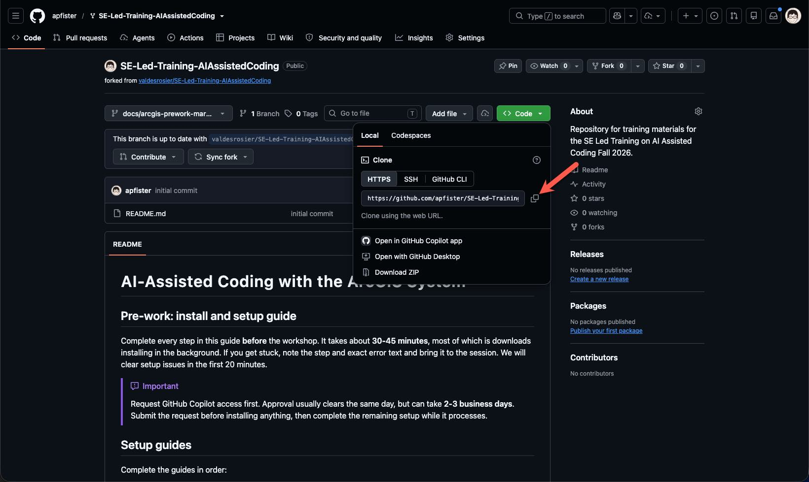

# Visual Studio Code setup

[Back to the pre-work overview](../README.md)

## Step 1: Install Visual Studio Code

Visual Studio Code (VS Code) is the free editor you will use to write code and work with Copilot.

1. Go to the [VS Code download page](https://code.visualstudio.com/download) and download the installer for your operating system.
2. Run the installer.
3. Launch VS Code to confirm that it opens.

On Windows, select these options on the **Select Additional Tasks** screen:

- **Add to PATH**
- **Add "Open with Code" to the context menu** (recommended)

> [!NOTE]
> **macOS:** Download the **Universal** build, unzip it, and drag `Visual Studio Code.app` into `/Applications`. On the first launch, right-click the application and select **Open** if macOS displays an unidentified-developer prompt.

## Step 2: Install the VS Code extensions

Open the **Extensions** panel, search for each extension by name, and install it from the verified publisher shown below.



| Extension               | Publisher | Why you need it                                                                                       |
| ----------------------- | --------- | ----------------------------------------------------------------------------------------------------- |
| **GitHub Copilot Chat** | GitHub    | Provides the AI assistant in VS Code. It might already be included in the current version.            |
| **Python**              | Microsoft | Supports the ArcGIS Notebooks and ArcPy section, including Pylance and the Python interpreter picker. |
| **Jupyter**             | Microsoft | Lets you prototype `.ipynb` notebooks locally before uploading them to ArcGIS Online.                 |
| **Live Preview**        | Microsoft | Renders HTML and CSS in a live-refreshing preview for the Hub cards section.                          |
| **ESLint**              | Microsoft | Flags JavaScript and TypeScript mistakes in the Maps SDK and Experience Builder sections.             |

## Step 3: Sign in to GitHub Copilot

After your [IST request from Step 2](01-github-and-copilot.md#step-2-request-github-copilot-access) is approved, connect Copilot inside VS Code.

### Windows

1. Select the **Sign In** button at the top of the VS Code window.

   

2. Choose GitHub and follow the browser prompts.

   

3. Confirm that Chat opens on the right side of the VS Code window. If it does not, select the Chat icon on the top bar.

   

4. Type `Hello` and confirm that Copilot replies.

### macOS

1. Select **View > Chat** to open the Chat pane.

   

2. At the bottom of the Chat pane, select **Models**, then select **Sign in to use Copilot**.

   

3. Select **Continue with GitHub** in the sign-in window.

   

4. Sign in to GitHub and follow the browser prompts.
5. Confirm that Chat opens on the right side of the VS Code window. If it does not, select the Chat icon on the top bar.

   

6. Type `Hello` and confirm that Copilot replies.

## Step 4: Fork & Clonethe Training GitHub Repository

1. Open up the training repo @ [SE-Led-Training-AIAssistedCoding](https://github.com/valdesrosier/SE-Led-Training-AIAssistedCoding).

2. In the top, right, select **Fork** and "Create a new fork" to create a copy of the repo in your GitHub account.
   
3. Select "Create Fork" to create a copy of the repo in your GitHub account. If the checkbox next to "Copy the <BRANCH_NAME>" is checked, be sure to un-check it. We want the default branch to be copied, not the branch you are currently on.

   

4. You will be taken to your forked repo. Leave this browser tab open.

5. Create a folder on your `C:` drive for this project and any future devleopment. . For example, `C:\dev`.

6. Open a new Powershell window and navigate to the folder you created in the previous step. For example, if you created a folder called `dev` on your `C:` drive, run the following command:

   ```powershell
   cd C:\dev
   ```

   

7. Back on in your browser, Click the green **Code** button and then click the copy button next to the HTTPS URL.

   

8. Back in your Powershell window, run the following command to clone your forked repo to your local machine. Replace `<YOUR_GITHUB_USERNAME>` with your GitHub username.

   ```powershell
   git clone https://github.com/<YOUR_GITHUB_USERNAME>/SE-Led-Training-AIAssistedCoding.git
   ```

9. You should see a new folder called `SE-Led-Training-AIAssistedCoding` in your `C:\dev` folder. You can now open this folder in VS Code.

Next: [Install Node.js, Python, and Git](03-development-tools.md)
