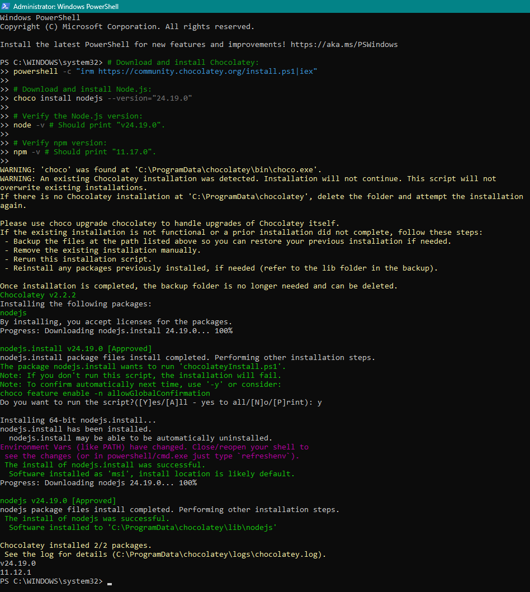
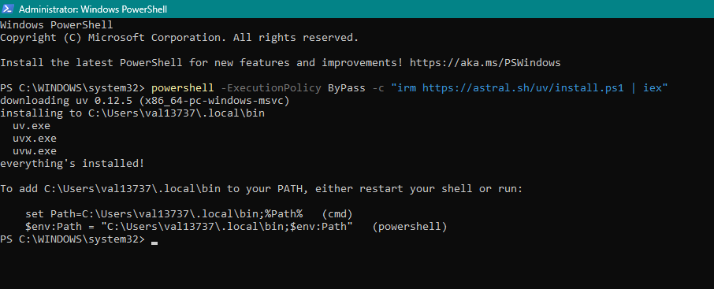
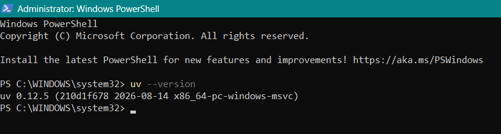

# Development tools

[Back to the pre-work overview](../README.md)

## Step 6: Install Node.js, Python, and Git

These tools run underneath the applications used in the workshop. Install all three; each takes a few minutes.

Before downloading an installer, open a terminal in VS Code with **Terminal > New Terminal** and check whether Node.js and Python are already installed:

```shell
node --version
python --version
```

If the terminal reports that a command is not recognized, follow the corresponding installation steps below. On macOS, check Python with `python3 --version` if `python` is unavailable.

## 6a: Node.js

Node.js runs JavaScript outside the browser so you can develop on localhost.

1. Open a new Powershell terminal as an Administrator.
2. Copy, paste, and run the following command to install Node.js:

   ```powershell
    # Download and install Chocolatey:
    powershell -c "irm https://community.chocolatey.org/install.ps1|iex"

    # Download and install Node.js:
    choco install nodejs --version="24.19.0"

    # Verify the Node.js version:
    node -v # Should print "v24.19.0".

    # Verify npm version:
    npm -v # Should print "11.17.0".

   ```

See below for the expected output once it has finished installing. If you are prompted during the installation, select/enter "Y" or "Yes" to continue.



## 6b: Python

Python is used for the ArcGIS Notebooks and ArcPy section.

1. Install the **uv** package to support Python in VS Code:

   ```powershell
   powershell -ExecutionPolicy ByPass -c "irm https://astral.sh/uv/install.ps1 | iex"
   ```

See below for the expected output once it has finished installing. If you are prompted during the installation, select/enter "Y" or "Yes" to continue.


2. Close Powershell and reopen it.
3. Verify that uv is installed:

   ```powershell
   uv --version
   ```



Next: [Set up Experience Builder Developer Edition (optional)](04-experience-builder.md)
