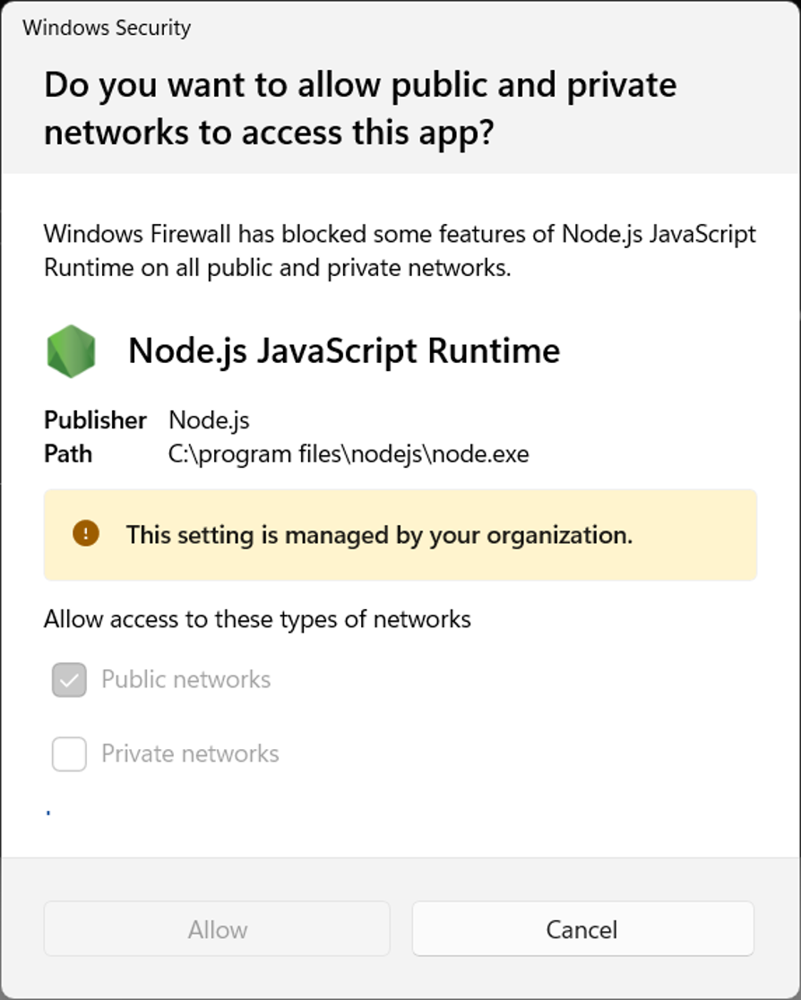

# Experience Builder Developer Edition

[Back to the pre-work overview](../README.md)

> [!NOTE]
> This setup is optional. Complete it only if you want to follow the Experience Builder widget section hands-on. You can watch that section without installing Developer Edition.

For the Experience Builder exercise, we'll develop a custom widget that can be hosted in ArcGIS Enterprise and look just like an out-of-the-box widget.

A quick note on versioning ([Experience Builder release and version table](https://developers.arcgis.com/experience-builder/guide/release-versions/)). Custom Experience Builder widgets can only be hosted in ArcGIS Enterprise, but you can also build fully custom apps on the framework and host them independently, which is why Esri releases downloadable versions that stay in step with ArcGIS Online. For this exercise, we're targeting a widget hosted on **ArcGIS Enterprise 12.1**, using **Experience Builder Developer Edition 1.20** — so that's the version you'll download.

> [!NOTE]
> There is a newer version (1.21) but it is contemporary with the ArcGIS Online Experience Builder, not ArcGIS Enterprise.

## Step 1: Download and Install Experience Builder Developer Edition

1. Download Experience Builder 1.20 from the [Experience Builder downloads](https://developers.arcgis.com/experience-builder/guide/downloads/)

2. Unzip the folder to a local spot on your machine (do not unzip in the downloads folder). For example: `C:\dev\arcgis-experience-builder-1.20` (on Mac, `~/dev/arcgis-experience-builder-1.20`).

## Create a Client ID

The developer edition of Experience Builder requires a Client ID to connect to ArcGIS Online or ArcGIS Enterprise. This is a unique identifier that allows the developer edition of Experience Builder to authenticate with your ArcGIS account and access the necessary resources.

1. Log into the ArcGIS Online or ArcGIS Enterprise organization that you'd like to use for this workshop. We will not go through deploying the widget on ArcGIS Enterprise, so these credentials will just serve to give you access to your existing Experience Builder apps, and either an ArcGIS Online or Enterprise organization will work.

2. In the New Item dialog box, select Application.

3. Under the Application type selection, choose the Other application option and click Next.

4. Enter the following parameters:
   - Title - Enter the application title, such as Experience Builder credentials.

   - Folder - Select a folder where the item will be stored within your Content.

   - Optionally fill Categories, Tags, and Summary if you prefer.

   - Click Save to create the application.

5. In the item detail page, under the `Credentials` section, click the `Manage` button.

6. In the `Redirect URLs` section, click the `+ Add` button and enter `https://localhost:3001/`.

7. At the bottom of the page, click the `Save` button.

8. Copy the `Client ID` to use it in the "Server Install" steps.

## Install the Server Service

The Server service is responsible for running the builder interface of developer edition of Experience Builder. The server service must be running in order to see your changes in the builder interface.

1. Open a command prompt or terminal window.

2. Within the terminal, browse to the server directory of the Experience Builder files that you unzipped in the steps above:

```powershell
cd C:\dev\arcgis-experience-builder-1.20\server
```

3. Run the following commands (If you get a privileges error, run `npm.cmd ci` and `npm.cmd start` instead):

```powershell
npm ci
```

```powershell
npm start
```

> [!NOTE]
> Starting with version 1.21, you must use pnpm to install dependencies. If you run npm ci or npm i with version 1.21 or newer, you will see an error. See the [Experience Builder Developer Edition install guide](https://developers.arcgis.com/experience-builder/guide/install-guide/) for more information if you're developing using the more recent versions in the future.

4. In a browser, open this URL: https://localhost:3001/. You should see the builder interface.

   Your browser will warn about the certificate the first time (it's self-signed and local) — choose **Advanced → Proceed** to continue.

   If you see this security alert, but local host opens without issue, you can safely `Cancel` out of the popup:

   

5. Specify the URL to your ArcGIS Online or ArcGIS Enterprise organization, and paste in the Client ID that you created in the previous section.

6. Leave this power shell or terminal open to keep it running.

## Install the Client Service

The Client service is responsible for running the webpack server, which is used to bundle and load your custom widgets and themes. The client service must be running in order to see your changes in the builder interface.

1. Open VS Code in a New Window.

2. In VS Code: File → Open Folder and open the folder location of your unzipped Experience Builder files.

3. Open a terminal inside VS Code: **Terminal → New Terminal** (or `` Ctrl+` ``).

4. Within the terminal, browse to the `/client` directory of the Experience Builder files that you unzipped in the previous section using the `cd` command.

```powershell
cd client
```

5. Run the following commands (If you had the privileges error from installing the server service, run `npm.cmd ci` and `npm.cmd start` as well):

```powershell
npm ci
```

```powershell
npm start
```

> [!NOTE]
> Starting with version 1.21, you must use pnpm to install dependencies. If you run npm ci or npm i with version 1.21 or newer, you will see an error. See the [Experience Builder Developer Edition install guide](https://developers.arcgis.com/experience-builder/guide/install-guide/) for more information if you're developing using the more recent versions in the future.

> [!NOTE]
> If you are using Chrome, you may experience issues. Try using Edge or Firefox instead.

5. Feel free to explore the Dev Edition on your machine, when you are done, type `ctrl+c` and `Y` to end the process for both the `/server` and `/client`. We will spin this back up during the final exercise in the training.
