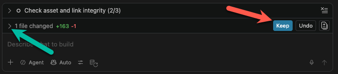
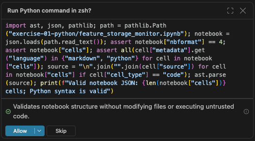
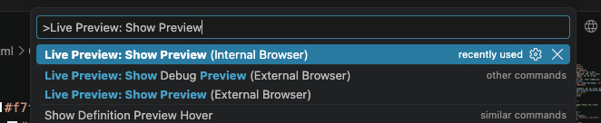

# Exercise 2 — ArcGIS Hub: Glass Cards (HTML / CSS)

> 💡 **Tip:** Press `Ctrl+Shift+V` to view this file as a formatted preview (or `Cmd+Shift+V` on Mac).

**What you'll build:** a set of modern "glassmorphism" cards in HTML and CSS that you can drop into an ArcGIS Hub site — frosted, semi-transparent panels that sit over a background image or map.

We'll design it first using `/grill-with-docs`, then build it.

> [!IMPORTANT]
> After copilot has finished responding, you can review what files were created, deleted, or changed by expanding the **Files changed** section in the chat. You can also click on any file to see a diff of what was added or removed. If you don't like the changes, you can click **Undo** to undo them. If you are fine with the changes, you can click the blue **Keep** button.



---

## Step 1 — The prompt

1. Open a new chat in the GitHub Copilot panel by selecting the `+` button at the top of the window. Ensure your model is set to "Auto".

2. Start by typing a forward slash (`/`) to see the list of available skills. Select `/grill-with-docs` from the list by arrowing up or down to highlight it and then press tab, but do not press enter yet.

3. Paste the following prompt after the pill.

```
I want to build a set of "glass" cards in plain HTML and CSS that I can add to an ArcGIS Hub site. The look I'm going for is glassmorphism: frosted, semi-transparent panels with a soft blur, a thin light border, and a gentle shadow, sitting on top of a background image.

Before grilling me on design decisions, use the the arcgis-html-css skill and the arcgis-docs-lookup skill to look up anything you are not sure about for the overall design and approach.

Each card should have:
- a title
- a short description
- an icon or small image
- a button or link

I'd like a few cards laid out in a responsive row that stacks on
smaller screens. Keep the code simple and self-contained so I can paste it into a Hub embed, and make it easy to swap the colors, text, and background later.

Ask me about anything ambiguous — like how many cards, the color theme, and whether the cards should link out or open something — before we settle the design.

Write all code and files for this project only inside the `exercise-02-htmlcss/` folder in this repo. Create it if it doesn't exist. Don't add or modify files anywhere else in the repo.
```

4. Press `Enter` to run the skill.

## Step 2 — What happens next

1. Answer each question in the chat. You can answer however you like, as long it's clear to the model which question you are answering. You can also ask follow up questions to clarify anything you don't understand. The skill will write down the design as you go.
   - Example: "q1: agreed, q2: explain in less technical terms, q3-6: agreed, q7: yes but add ..."

   > [!NOTE]
   > Copilot may ask your approval to run commands during the course of a response. Be sure to review the **command summary** beneath the code preview to see what commands it wants to run. If you approve, click **Allow**. If you don't, click **Skip** and ask the model to clarify or change its approach.

   

2. When the design is settled, copilot may begin implementing on its own. If not you can use the `/implement` skill to tell it to start building the cards and any other files needed for the project.

3. Preview it with **Live Preview** (steps below).

### Previewing your cards in VS Code

Use the **Live Preview** extension — it shows your page in a pane inside VS Code and refreshes as the file changes.

1. If you don't have it yet: open Extensions (`Ctrl+Shift+X` / `Cmd+Shift+X` for Mac), search **Live Preview** (by Microsoft), and install it.

2. In the sidebar, click once on the `index.html` that was created to open it in the code editor.

3. Press `Ctrl+Shift+P` (or `Cmd+Shift+P` for Mac) and start typing `Live Preview` select either **Live Preview: Show Preview (Internal Browser)** or **Live Preview: Show Preview (External Browser)**.

   

4. A browser pane opens either inside VS Code or in your default web browser at a `localhost` address and updates every time you save.

   > [!NOTE]
   > Other preview option: you can also double-click the HTML file in File Explorer to open it in your browser. That's fine for static cards, but Live Preview is the smoother option and avoids browser security blocks if your cards ever pull live data.

5. Work through any iterations / changes with the assistant.

## Step 3 — OPTIONAL — Add it to an ArcGIS Hub site

- Paste it into an ArcGIS Hub site Text HTML/CSS.

## Want to go further?

If you finish early, ask the agent about cooler additions, for example:

- Cards that **flip or expand** on hover to reveal more,
- A **live stat** on each card pulled from a feature layer,
- Matching the card colors to your Hub site's theme automatically.

Feel free to also test with other models to see how they vary in output.
